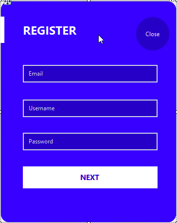

# Système de Location de Voitures

Ce projet est une application de gestion de location de voitures développée en utilisant C# (.NET) et SQL Server. L'application permet de gérer les clients, les voitures disponibles, ainsi que les factures de location.

## Fonctionnalités

- **Gestion des Clients :** Ajouter, afficher, mettre à jour et supprimer des clients.
- **Gestion des Voitures :** Ajouter, afficher, mettre à jour et supprimer des informations sur les voitures disponibles.
- **Facturation :** Créer des factures de location en associant un client, une voiture et des dates de début et de fin de location.

## Configuration de la Base de Données

1. Exécutez le script `script.sql` dans SQL Server Management Studio pour créer la base de données `CarRentalSystem`.
2. Assurez-vous de mettre à jour la chaîne de connexion dans le fichier `App.config`.

## Utilisation

- Lancez l'application depuis Visual Studio.
- Gérez les clients, les voitures et les factures à l'aide de l'interface utilisateur conviviale.

## Captures d'Écran

## Auteur

Ce projet a été créé par [El Mahdi BOUAITI] et [Anass ERRIFAI].

## Contributions

Les contributions sont les bienvenues ! Si vous souhaitez contribuer, ouvrez une Pull Request pour discuter des changements proposés.

